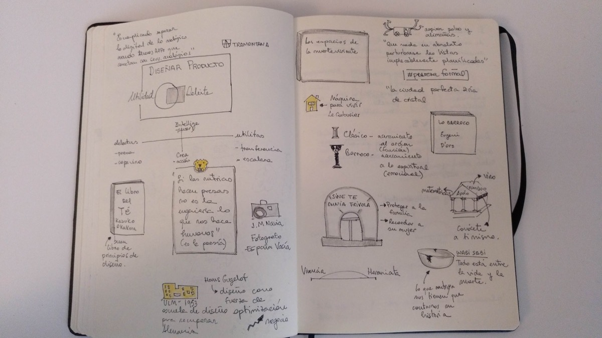
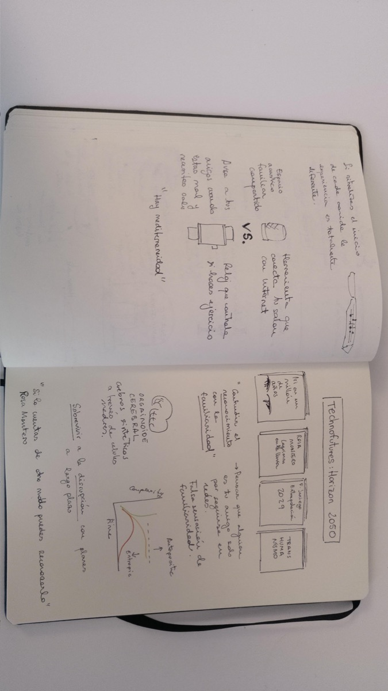

# Spotlight. Diseñar productos entre la utilidad y el deleite

## Datos generales
* **Fecha:** 28 de junio 2019
* **Organiza:** Sngular
* **Ponente:** Javier Cañada
* **Descripción:** Javier Cañada hablará en esta primera edición del evento Spotlight sobre cómo nuestra historia, creencias y valores han influido históricamente en qué creamos y qué forma le damos y cómo entendiéndolas mejor podemos crear mejores productos interactivos. Hablará también de su propósito al frente del Instituto Tramontana

[Más información](https://www.eventbrite.es/e/entradas-disenar-productos-entre-la-utilidad-y-el-deleite-75101571823){: .btn  .btn-blue }

## Skechnoting

