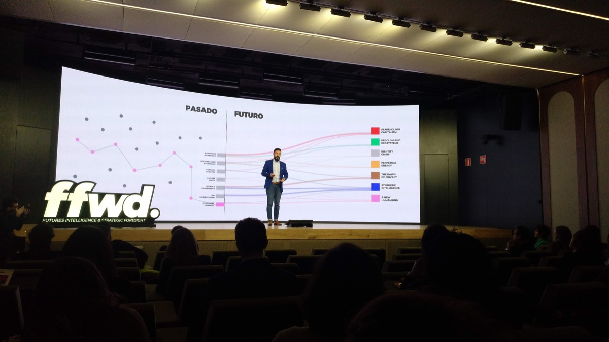
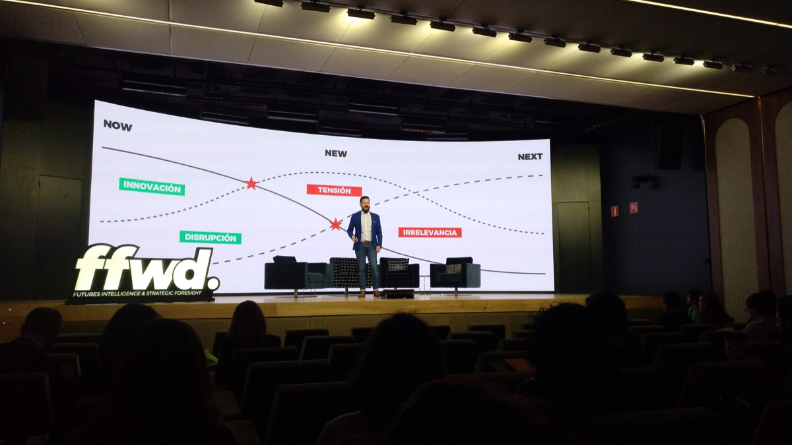

# Futures Next 2020

## Datos generales
* **Fecha:** 21 de enero 2020
* **Organiza:** [FFWD - Futures Intelligence & Strategic Foresight](https://ffwd.is/)
* **Descripción:** Este año 2020 marca la entrada a la década de la inteligencia. Una década transformacional a la que hemos dirigido nuestro sistema de Futures Intelligence con el objetivo de identificar las señales y tendencias que definirán nuestra sociedad no sólo durante 2020, sino también durante la próxima década.  
Nuestro equipo de expertos y nuestro sistema de I.A. ha escuchado, analizado y clasificado millones de conversaciones de diferentes industrias a nivel global para dar forma a Futures Next 2020, una conferencia de futuros donde profundizaremos en las 7 grandes narrativas que dominarán el año que acaba de comenzar.

[Más información](https://www.eventbrite.es/e/registro-futures-next-2020-87935277783){: .btn  .btn-blue }

## Notas
### Pasado, presente y futuro

El pasado es lo que nos hace ser lo que somos. Construímos una historia que nos dote de coherencia, una historia que no necesariamente debe ser cierta.

El hoy, es esa delgada línea que separa el pasado del futuro. Está en constante movimiento y es dónde podemos generar los cambios.

El futuro es incertidumbre pura y dura. Podemos apalancarlos en los puntos de incertidumbre del presente para crear futuros o anticiparnos a lo que puede suceder.

### Stakeholder Capitalism
Fin de la doctrina Friedman, principio empresarial de basar la actividad de la compañía en generar un aumento de valor para los accionistas (shareholders). Se trata de encontrar un propósito más allá de vender el producto.

The end of disposble things. Cambia la forma de consumo, ya no aceptamos como buenas las cosas de usar y tirar. Parece que hay una conciencia, lo que antes nos parecía bien ahora ya no. Hay un cambio la visión de la realidad -> EFECTO GRETA <-

Ahora tenemos la opción de cancelar las cosas que no cuadran con tu forma de ver el mundo.

### Identity Crisis
Se acaba la era del hombre blanco hetero cis. En Europa nos creíamos los reyes del mundo, de hecho sobredimensionamos nuestro tamaño en el mapamundi. Europa es más pequeña que Kazajistan.

Es por ello que ciertos sectores elevan la cultura, o lo que ellos entienden por cultura, como una forma de protección contra lo supuestamente "no europeo". Por ejemplo alguien de tercera generación en Francia que como no es blanco no es suficientemente europeo.

### Dawn of privacy
La sociedad es inocente con respecto al uso que se hace de los datos que facilitamos a cambio de servicios "gratuitos". Pero por el caminos se están generando sistemas de scoring humano como el "Social Score System" en China. En la que según tu score se te da prioridad para ciertos trámites.

### Synthetic Intelligence
Hablamos de inteligencia sintética y no de inteligencia artificial porque estamos hablando de una autonomía de una inteligencia que es capaz de generar sus propios modelos. Sería lo más parecido a tener un hijo educarlo y esperar que se comporte adecuadamente.

Toda tecnología desnaturaliza el contexto. Pero incluímos en tecnología conceptos como la agricultura. ¿Qué es desnaturalizar? ¿Qué es lo natural?

### Generation Boost
Pastillas para incrementar el rendimiento, se hacen pruebas en Harvard antidopping para los exámenes.

Ver en Netflix: Unnatural Selection

### Perpetual Energy
El acceso a los tipos de energía es de lo que mayor desigualdad genera en el mundo. En un futuro podríamos hablar de derechos energéticos.

Nos enfrentamos al reto de almacenar la energía que necesitamos. ¿Cómo reciclar energía? ¿Basura energética?

### Mesa redonda: A new humankind
Hemos pasado de interpretar la necesidad de privacidad como algo propio, "es tu problema si tienes algo que esconder", a hablar de la privacidad como un derecho.

El nivel de acceso a la tecnología es una de las cosas que más genera desigualdad. Debemos reflexionar sobre si queremos seguir potenciando esa desigualdad y generar mundos de varias velocidades.

Auditorías externas de las nuevas herramientas para garantizar que no se va a generar ningún perjuicio en la sociedad, a pesar del objetivo empresarial de la compañía que lo lance.

¿Cómo podríamos evitar los sesgos? Buscando y garantizando un ámbito diverso. Esto es una decisión consciente que hoy hay que tomar. ¿Cómo podríamos abrir el proceso a la diversidad para identificar los sesgos?

El dato como herramienta de empoderación del usuario. No hay problema en utilizar el dato sí:

- Se usa responsablemente
- Eres honesto
- Y ofreces algo a cambio

Tenemos la necesidad de diferenciar entre datos agregados para el bien común y los datos que invaden tu privacidad.

Los datos, o tu histórico de datos puede ser tu médico, tu psicólogo o tu coach. Ya no son algo frío, contienen una historio, un alma. El día de mañana se podría donar parte de los datos al igual que se donan órganos.

- Métodos de anonimización
- Métodos de agregación
- Y herramientas para gestionar datos sin tener que conocer el detalle

La tecnología carente de contenido no tiene sentido. (Ante la pregunta ¿Qué tecnología debería estar en las aulas?) Deberíamos trabajar las habilidades que nos diferencian de las máquinas.

Educación vs. aprendizaje

Actualmente se utilizan las herramientas que se necesitan en cada momento. "No necesito un MBA para emprender una empresa". (Inconsciencia, tal vez...)

Necesitamos nuevos indicadores para un nuevo capitalismo.

## Reflexiones
¿Son las tendencias narrativas del futuro o son narrativas del presente más candente?

¿Cómo podríamos accionar estas narrativas dentro del laboratorio de innovación? ¿Podrían ser una forma de explorar nuevas líneas de investigación? ¿Podrían resultar nuevos hilos por los que encontrar nuevas tecnologías?

Estas narrativas tienen la capacidad de hacernos soñar, de imaginar un futuro diferente a nuestro día a día. Pero ¿cuáles serán las innovaciones que realmente afecten el día de mañana? ¿serán las más efectistas? o por el contrario ¿ganarán aquellas que se imponen de forma silenciosa?
