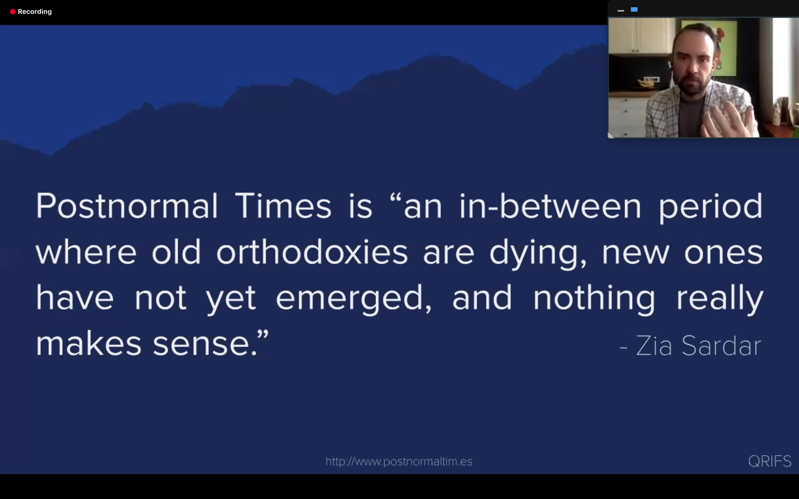

# The Great Pause: Global Foresight Summit

## Datos generales
* **Fecha:** 9 - 11 de abril 2020
* **Organiza:** [FFWD - Futures Intelligence & Strategic Foresight](https://ffwd.is/)
* **Descripción:** Billions of people around the globe are under lockdown. Business as usual is not usual anymore. Governments rush to adopt imperfect policies to protect citizens and defend national sovereignty. An invisible threat has humankind under siege, attacking everything and everyone we know, and the future will never be the same again.

[Más información](https://www.globalforesightsummit.com/){: .btn  .btn-blue }

## Índice de charlas escuchadas

  1. [Covid19 both is and is not a black swan (and that's ok): futures in, through, and beyond a time of crisis. John A. Sweeney.](#covid19-both-is-and-is-not-a-black-swan)
  2. [Next talk](#)

---

## 1. Covid19 both is and is not a Black Swan

### Notas

La crisis no es algo en singular, debemos abrazar la complejidad y entender que este es un fenómeno en plural que debe abordarse desde la diversidad.

El diseño de futuros no se trata de acertar si no de encontrar nuevas formas de ver las cosas. Nuestra tarea es abrir ventanas dónde había paredes, tanto para ver cosas nuevas como para dejar que entre la luz ahí donde estamos.

**Potsnormal Times Theory:** es un periodo de transición dónde las antiguas ortodoxias están muriendo, las nuevas no han aparecido y nada parece tener sentido. ¿Cómo podemos crear sentido para el futuro basándonos en el propósito, necesidades y valores de la gente?

¿Cómo podemos definir lo que es un cisne negro? ¿El 11 de septiembre lo fue?

Las **metáforas** que utilizamos afectan en nuestras decisiones. (Beast vs. Virus) Actualmente se está utilizando la metáfora de la guerra para esta crisis del Coronavirus, pero es una metáfora limitada en la que hay ciertos valores y principios éticos implicados.

Se propone una metáfora alternativa, la del **Tsunami del cambio**  que nos permite entender que el futuro no se puede predecir y que los cambios van a seguir viniendo de forma continua. Tenemos la capacidad de actuar en este ambiente y al surfear esta mega ola tenemos el reto de sentir como llegan los cambios y de adaptarnos a ellos.

### Recursos y enlaces

  * https://postnormaltim.es/
  * [The Three Tomorrows of Postnormal Times](https://postnormaltim.es/sites/default/files/uploads/Sardar%20content/Three%20Tomorrows%20PNT%20SARDAR%20SWEENEY%20Futures%202016.pdf)
  * http://www.metafuture.org/library/Narrative-foresight-published.pdf
  * [Metaphors We Think With: The Role of Metaphor in Reasoning](https://journals.plos.org/plosone/article?id=10.1371/journal.pone.0016782)
  * [Surfing Tsunamis of Change](http://www.futures.hawaii.edu/publications/futures-visions/SurfingTsunamisMexico1994.pdf)

---

## Next talk

### Notas

### Recursos
