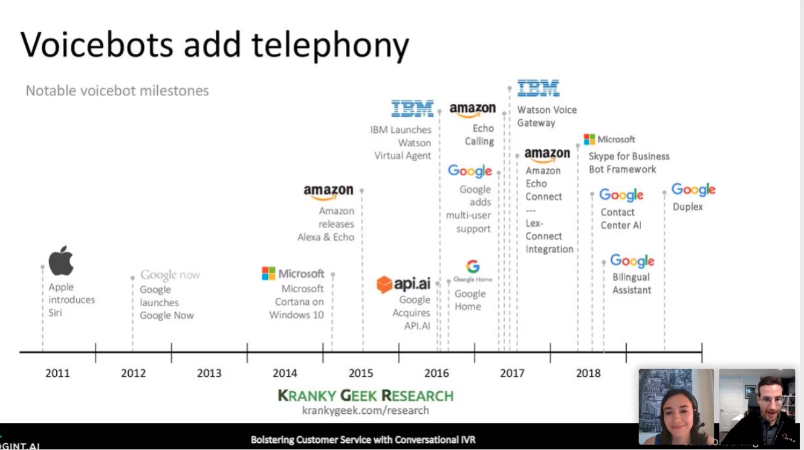
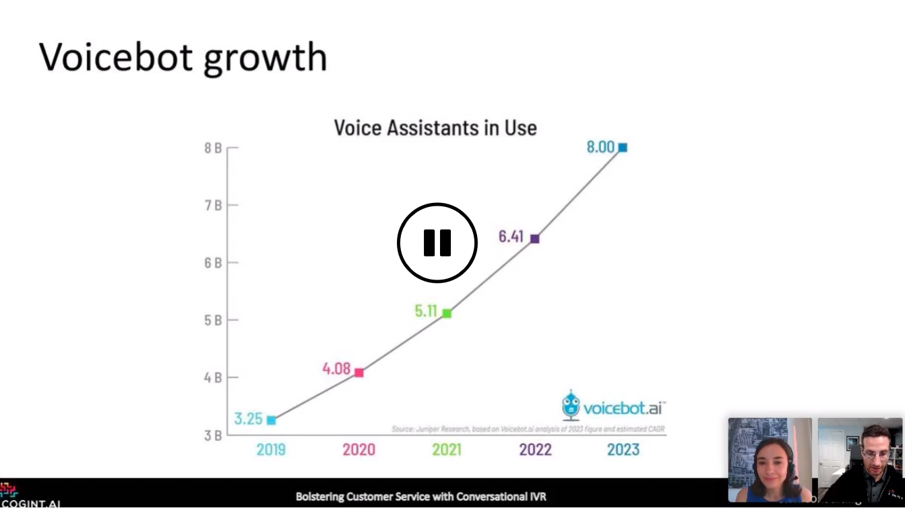
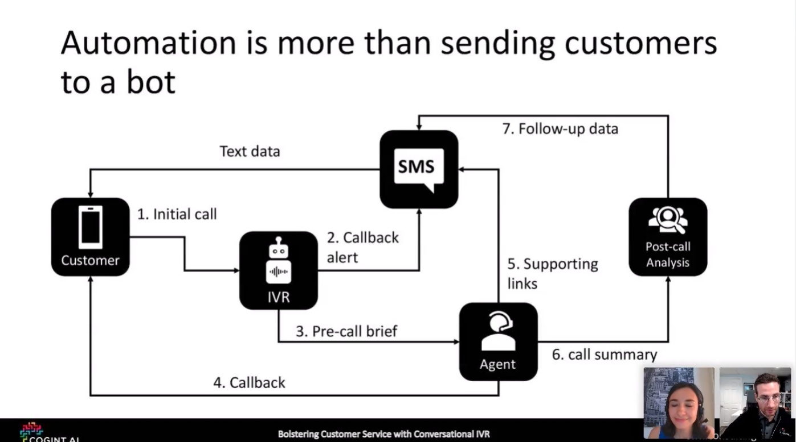
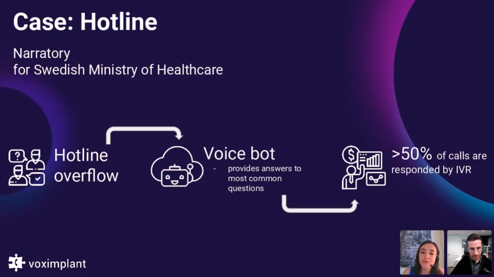

# Voximplant: Phone Calls Automation

## Datos generales
* **Título webminar:** Bolstering Customer Service during uncertain call volumes using Conversational IVRs (Interactive Voice Response)
* **Fecha:** 7 de abril 2020
* **Organiza:** [Voximplant](https://voximplant.com/)
* **Descripción:** Estamos en tiempos sin precedentes con muchas empresas que enfrentan escasez de personal al mismo tiempo que experimentan un aumento en el volumen de llamadas. La automatización es esencial, pero no tiene que ser horrible para los clientes. Afortunadamente, las IVR modernas de conversación y las tecnologías de agente virtual han evolucionado hasta un punto en el que pueden satisfacer una amplia variedad de escenarios de clientes y ser rentables para la mayoría de las empresas.

[Video webminar](https://event.webinarjam.com/replay/7/3v81pi7avu8u8w){: .btn  .btn-blue }

## Notas

Voximplant es un software para la gestión automática de llamadas. Permite tanto la gestión de llamadas entrantes como la emisión de llamadas automáticas para el registro de feedback o similar.

Hacen un repaso de **los antiguos sistemas de automatización de llamadas que incrementaban la frustración** de los usuarios al tener que encajarse en una arquitectura poco natural para su modelo mental.

Presentan también la aceptación que están teniendo los asistentes basados en lenguaje natural, lo que permite en el sector de atención al cliente gestionar las peticiones de los clientes de una forma más intuitiva.

Pero alertan que la automación es más que enviar clientes a un bot: **hay que crear un soporte y un entorno supervisado por seres humanos** para que la atención al cliente no se vea devaluada.

Cuentan el caso real de la gestión de llamadas en **Suecia,** en el que gracias a la implantación de esta herramienta **han podido dar soporte a más del 50% de forma automática**. Sin duda es una gran herramienta que toma total sentido en estos tiempos, en los que los teléfonos de soporte están viéndose desbordados.

Muchas veces el cliente solo necesita una respuesta rápida sobre un tema fácilmente automatizable, sin tener que esperar. El hecho de no tener que esperar, compensará el hecho de tener que hablar con una máquina que no siempre acertará.

## Reflexiones

Resulta interesante la potencia de poder utilizar los bots en llamadas teléfonicas:

* Parece **una forma más natural de introducir la tecnología de bots conversacionales** en la población más allá de los smart speakers

* Y una forma de **ampliar el espectro de canales** que tenemos para conectar a nuestro usuario

  * Tanto para **abrir líneas de soporte** para el personal o sectores para los que quizá no se suela invertir en soporte.

  * Como para emitir **llamadas de seguimiento** y control de la salud, sin duda, una forma más directa que un formulario.

Además el coste de este tipo de servicios parece bastante reducido frente a la opción de poder automatizar llamadas, sobre todo en entornos de alta demanda no predecible.

La interfaz para programar las respuestas es bastante sencillo, por lo que habilita a cualquier perfil a automatizar estas llamadas.

## Recursos
[Mail comercial] Enlaces útiles de cómo Voximplant pueden ayudar a su negocio con la automatización de llamadas:

* [Como crear una campana de llamadas de salida con Marcador predictivo](https://www.youtube.com/watch?v=yycCxeNh1DM&list=PLtqT7syZpCVK0nhoRLKeVODAOLPhZYzmr&index=11)

* [Como configurar un IVR en Smartcalls en 5 minutos](https://www.youtube.com/watch?v=WwByf8n8xzk&list=PLtqT7syZpCVK0nhoRLKeVODAOLPhZYzmr&index=12)

* [Crea un BOT de voz en 2 minutos con Dialogflow y Voximplant](https://www.youtube.com/watch?v=ZVBigByM_1s&list=PLtqT7syZpCVK0nhoRLKeVODAOLPhZYzmr&index=14)

* [Como agregar un Agente de Dialogflow con Smartcalls](https://www.youtube.com/watch?v=IBOebJwGgAw&t=63s)
