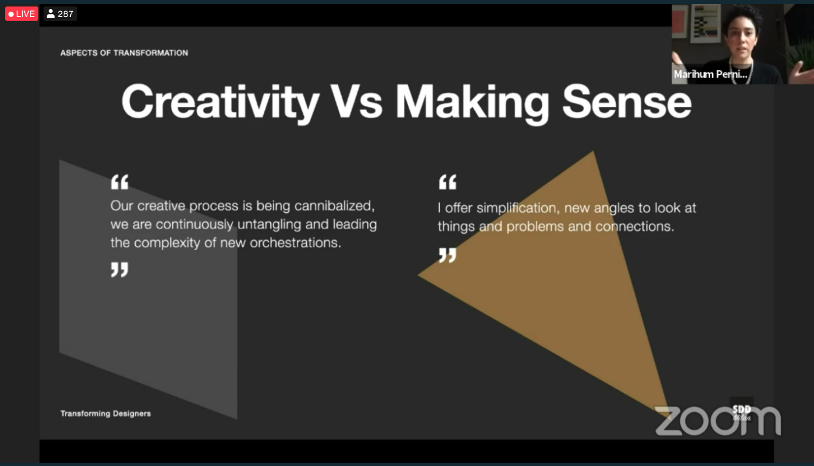
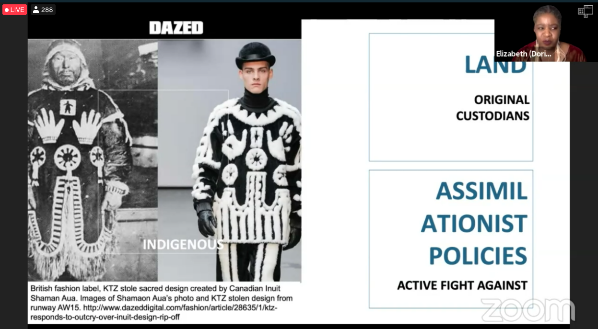

# Service Design Global Conference 2020 - Embracing Change

## Datos generales
* **Fecha:** 22 de octubre 2020
* **Organiza:** [Service Design Global Network](https://www.service-design-network.org/)
* **Descripción:** In challenging times, service design is more important than ever. For Virtual SDGC20, we brought together the leading minds in service design who exhibited work from all around the world.

[Más información](https://www.service-design-network.org/events/virtual-sdgc20){: .btn  .btn-blue }

## Índice de charlas escuchadas
1. Sparking Change and Inspiring Patients - [Ver notas](#1-sparking-change-and-inspiring-patients)
2. Designing Gender Inclusive Financial Services for low income women - [Ver notas](#2-designing-gender-inclusive-financial-services-for-low-income-women)
3. The Act of Design Has Been Disrupted - [Ver notas](#3-the-ac-of-design-has-been-disrupted)

## 1. Sparking Change and Inspiring Patients
*Sara Josefberg*

La cocreación es una buena idea pero no podemos hacerla en este momento. ¿Cómo podemos implicar a la gente en el proceso sin dinámicas de cocreación que consumen tiempo y dinero?

Una buena idea es crear una conversación después de la entrevista. **Preguntar a los participantes si hay algo que no esté en la transcripción** y para ellos cuál es la parte más importante que hayan dicho.

* [Patient Collaboration Toolkit](https://patient-collaboration-toolkit.squarespace.com/)

## 2. Designing Gender Inclusive Financial Services for low income women
*Unpair Shafique (Ideate)*

**Solo el 7% de las mujeres están bancarizadas en Pakistan frente al 35% de los hombres.** ¿Por qué hay esta diferencia tan grande en Pakistan? Los servicios financiancieros actuales no están pensados para las mujeres.

Man Ji, es una de las líderes del comité. **Ella es el banco perfecto:** pertenece a la comunidad y las mujeres se sienten a gusto con ella. Tiene un sistema de préstamo y gestión de finanzas en su comunidad, todo basado en la confianza personal.

Pero, ¿para qué se necesita esta inclusión financiera? En el caso de una mujer con marido en principio no son grandes las decisiones financieras que debe tomar, pero en el momento que queda viuda/sola necesita tener herramientas que le ayuden a gestionar y a tomar decisiones.

Y **¿por qué no llevar los servicios financieros a su puerta?** Las mujeres son asiduas a servicios puerta a puerta, y esta sería una forma de facilitarles el acceso.

## 3. The Act of Design Has Been Disrupted
*Marihum Pernia - OpenKnowledge Srl. / Service Design Drinks Milan*

El rol de diseño ha evolucionado y es importante entender la forma en la que están mutando las actividades del día a día. Están abordando una investigación precisamente para esto:

* [transformingdesigners.com](https://www.transformingdesigners.com/)

¿Cuál es nuestro propósito como diseñadoras? Necesitamos adquirir nuevo conocimiento y reenmarcar nuestro rol. No tengamos miedo de ser perfiles híbridos, *build your own story fluid identity.*

## 4. Full Stack Service Designers
*[Sarah Drummond](https://twitter.com/rufflemuffin) - Snook*

Caso de AddAction/We are with you: cómo replantear un servicio de ayuda psicológica para que llegue a más gente de una forma más significativa.(Renaming, reframing...)

## 5. Decolonising Design
*DORI TUNSTALL - OCAD University*

Respectful design.Don’t have to choose between your identity or seem profesional.

Abrir las candidaturas a diferentes personas que quizá no han tenido acceso a las instituciones académicas tradicionales, y enfocar el problema desde otra perspectiva. You need a representation of diverse people if you want to decolonize. Where do we have underrepresentation.

>**Our job as designers is to show what is possible.**

## 6. Trust as a Design Material 
*Louise Vittrup Christensen Denmark | Senior UX Designer, 1508*

The power we have when we have access to others phones Is the power we have in service designer.

Trust was being used to trick users, a kind of persuasion.
Trust; Something about relationships. Force that moves us from the snow to unknown .

There has been  an evolution of trust.

- LOCAL TRUST: trading relationships. Bad reputation in case of bad behavior.
- INSTITUIONAL TRUST:
- Breach of trust:
- Distributed trust:

¿How to design with trust?

# 7. Do No Harm—Embracing Humanitarian Practices for Ethical Service Design
*Cassie Jiun Seo Norway | Service Design Lead, Norwegian Refugee Council*

How to avoid unintended consequences?
Ask what do you need? How I can help? Validate your assumptions

Consider potential risks and treat them ethicaly
How can we be listening to our more silent users?
Where is my place in the ecosystem

Intentional or unintentional harm to my users?
What is my privilege and responsibility that come with it.

.png)
