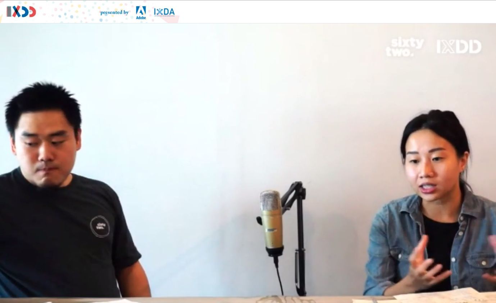

# IxDA - World Interaction Design Day

## Datos generales
* **Fecha:** 29 de septiembre 2020
* **Organiza:** [IxDA](https://ixda.org/)
* **Descripción:** World Interaction Design Day is an annual event where we come together as a united global community to show how interaction design improves the human condition. Our aim is to have a positive, long-lasting impact by facilitating activities that support dialogue and outcomes.

[Más información](https://interactiondesignday.org/){: .btn  .btn-blue }

## Índice de charlas escuchadas
* IxDA Jakarta: Enabling Rural Community Involvements for Sustainable Culture Through Technology [Ver notas](#1-enabling-rural-community involvements-for-sustainable-culture)

## 1. Enabling Rural Community Involvements for Sustainable Culture
*Victoria Simansjah - Product Designer and Manager at [Sixty Two](https://www.instagram.com/sixtytwo.co/?hl=es)*

En las zonas rurales no tienen acceso a las novedades tecnológicas y cosas que damos por hecho que se conocen son desconocidas para ellas. En el campo de investigación debemos entender correctamente sus necesidades y trabajar por validar nuestras asunciones. Tenemos que entender cómo las diferentes culturas están afectando el contexto de esta estas personas.

Parece que hay una tendencia de diseñar una nueva app para aportar una nueva solución, pero es importante **reflexionar sobre ese cosmos complejo de aplicaciones que ya existen**. Asentar nuestra solución en una aplicación que ya existe, como facebook, puede ser clave en el éxito de la misma.

La investigación es el primer punto de contacto con las personas para incorporarlas al proceso y asegurarno que están alineadas, que sepan que estamos intentando solucionar algo que es doloroso para ellas. **Es importante mostrarse presente, ir al campo para que las personas puedan confiar en ti.**

**La tecnología tiene muchísima potencia en las áreas rurales, sobre todo conectando comunidades** que nunca antes habían conversado. Pueden compartir conocimientos y prácticas que nunca antes habían puesto en común. Símplemente es mostrar las oportunidades que existen.

**Design for offline** es diseñar teniendo en cuenta a qué funcionalidades se podrá tener acceso sin estar conectado a la red y qué otras funcionalidades serán online. Es preguntarse ¿cuánto de útil puede ser la aplicación aunque no se tenga conexión?

**Vernacular Design Principles** principios de diseño que nos permiten enfocar el reto de diseño de una forma más sostenible (https://medium.com/@bjornmeansbear/some-vernacular-design-principles-their-application-today-241743c93b1d)

