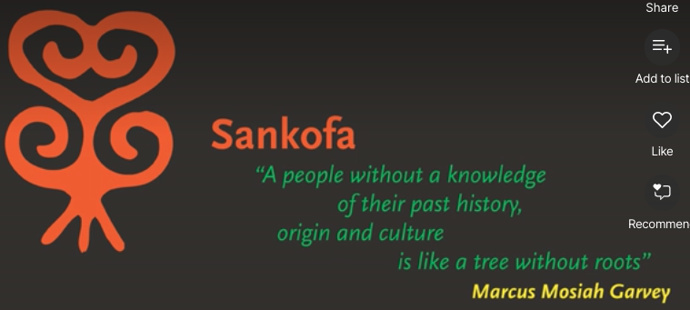

# IxDA - World Interaction Design Day

## Datos generales
* **Fecha:** 29 de septiembre 2020
* **Organiza:** [IxDA](https://ixda.org/)
* **Descripción:** World Interaction Design Day is an annual event where we come together as a united global community to show how interaction design improves the human condition. Our aim is to have a positive, long-lasting impact by facilitating activities that support dialogue and outcomes.

[Más información](https://interactiondesignday.org/){: .btn  .btn-blue }

## Índice de charlas escuchadas
* IxDA Jakarta: Enabling Rural Community Involvements for Sustainable Culture Through Technology [Ver notas](#1-enabling-rural-community-involvements-for-sustainable-culture)
* IXDD - Cape Town: Negociating Culture and Sustainability in an African context - Panel discussion [Ver notas](#2-ixdd---cape-town-negociating-culture-and-sustainability-in-an-african-context---panel-discussion)
* IXDA London: Design under pressure [Ver notas](#3-ixda---london-design-under-pressure)

## 1. Enabling Rural Community Involvements for Sustainable Culture
*Victoria Simansjah - Product Designer and Manager at [Sixty Two](https://www.instagram.com/sixtytwo.co/?hl=es)*

En las zonas rurales no tienen acceso a las novedades tecnológicas y cosas que damos por hecho que se conocen son desconocidas para ellas. En el campo de investigación debemos entender correctamente sus necesidades y trabajar por validar nuestras asunciones. Tenemos que entender cómo las diferentes culturas están afectando el contexto de esta estas personas.

Parece que hay una tendencia de diseñar una nueva app para aportar una nueva solución, pero es importante **reflexionar sobre ese cosmos complejo de aplicaciones que ya existen**. Asentar nuestra solución en una aplicación que ya existe, como facebook, puede ser clave en el éxito de la misma.

La investigación es el primer punto de contacto con las personas para incorporarlas al proceso y asegurarno que están alineadas, que sepan que estamos intentando solucionar algo que es doloroso para ellas. **Es importante mostrarse presente, ir al campo para que las personas puedan confiar en ti.**

**La tecnología tiene muchísima potencia en las áreas rurales, sobre todo conectando comunidades** que nunca antes habían conversado. Pueden compartir conocimientos y prácticas que nunca antes habían puesto en común. Símplemente es mostrar las oportunidades que existen.

**Design for offline** es diseñar teniendo en cuenta a qué funcionalidades se podrá tener acceso sin estar conectado a la red y qué otras funcionalidades serán online. Es preguntarse ¿cuánto de útil puede ser la aplicación aunque no se tenga conexión?

**Vernacular Design Principles** principios de diseño que nos permiten enfocar el reto de diseño de una forma más sostenible. Post sobre principios de diseño vernacular: [https://medium.com/@bjornmeansbear/some-vernacular-design-principles-their-application-today-241743c93b1d](https://medium.com/@bjornmeansbear/some-vernacular-design-principles-their-application-today-241743c93b1d)

## 2. IXDD - Cape Town: Negociating Culture and Sustainability in an African context - Panel discussion
La cultura es lo que sostiene la sociedad, lo que la hace sostenible. La novedades en tecnología pueden ayudar a impulsar comportamientos sostenibles. La cultura provee de una lente para una consideración ética. La ética incluye el estudio de valores como la integridad, la honestidad, la competencia, la confianza, seguridad y la responsabilidad social y ambiental.

La visión dominante es extremadamente dominante, ¿cómo podemos habilitar desde las escuelas de diseño ese desaprender para pensar diferente, de forma crítica?

[Saki Mafundikwa](https://www.ted.com/speakers/saki_mafundikwa) habla de la necesidad de recuperar tu propia cultura. Cada clase está repleta de gente muy diversa, con diferentes orígenes. El problema es que esta gente está perdida, se siente extranjera en el campo de diseño, pero lo que tiene que hacer es sentir quién es verdaderamente. La forma que tenemos de resolver problemas es a través de la perspectiva de nuestra identidad, nuestros orígenes. Cuando eso se comprende, se consiguen resultados sorprendentes.

[Ralitsa Diana Debrah](https://cumulusgreen.org/ralitsa-diana-debrah/) nos habla de la filosofía Ubuntu para el diseño. La idea de diseñar con un propósito, primando el impacto que consigues en la comunidad.

## 3. IXDA London: Design under pressure
*Molly Wilson*

Designers have been trained to take a basically optimistic perspective on the world. **We believe that**, as long as we are addressing people's needs, as long as we offer efficiency, clarity, meaning, and delight, **the universe as we know it will pretty much behave itself**. We treat threats – from hackers to stalkers, from pandemics to civil unrest – as edge cases that we can't possibly foresee. We figure that we'll handle when they come up. It took a pandemic to make many of us realize that every one of us lives in what we used to call an "edge case." And no, we can't just design with the constraints of each particular crisis in mind.

**We need to rethink our entire attitude**. We need to integrate adversarial thinking into human-centered design.We'll discuss **3 different methods that help you design for high-pressure contexts**. They're inspired by tools from the world of cybersecurity, a field that has long needed to design for resilience. These methods fit best in the synthesis, ideation, and prototyping phases. You should be familiar with the basic methods of human-centered design.

* [simplysecure.org](https://simplysecure.org/designunderpressure/#resources)
* [PPT de la presentación](https://simplysecure.org/resources/Design%20Under%20Pressure%20DT%20Barcamp%202020.pdf)

## 4. IXDA Berlin: Designing for Carbon Aware Digital Experiences
*Chris Adams*

Estamos en una crisis climática porque seguimos consumiendo recursos fósiles, en vez de buscar un camino para dejar de consumirlos.

Internet es la máquina más grande del mundo y mayoritariamente consume recursos fósiles. ¿Cómo podríamos modificar la forma que usamos internet? Cada vez es un sistema más eficiente energéticamente.

Bloom te muestra tu huella de carbono en función de en lo que inviertes.

GOLD (Green, Open, Lean, Distributed)

* [PPT de la charla de Chris Adams - Revisar links interesantes](https://docs.google.com/presentation/d/1wkGGemvWxQOX3U8XicBLcHjBWVkM7dAg6dVz4pqNtWI/edit#slide=id.p
)

*Lucia Ye - [luciaye.com](https://www.luciaye.com/)*

Presenta el diseño especulativo de un sistema operativo que modula el uso de internet en base al consumo de CO2, para que en vez de estar siempre online estar siempre *onling* (alineados). La información que nos ofrece nos permite cambiar nuestro comportamiento.

* [Onlign OS and Applications](https://www.luciaye.com/onlign/)

## Recursos compartidos
* [Tablero de compartición de la edición Europea](https://miro.com/app/board/o9J_koNYWFs=/)
* [Fundamentals of Data Visualization - Claus O. Wilke](https://clauswilke.com/dataviz/index.html)
