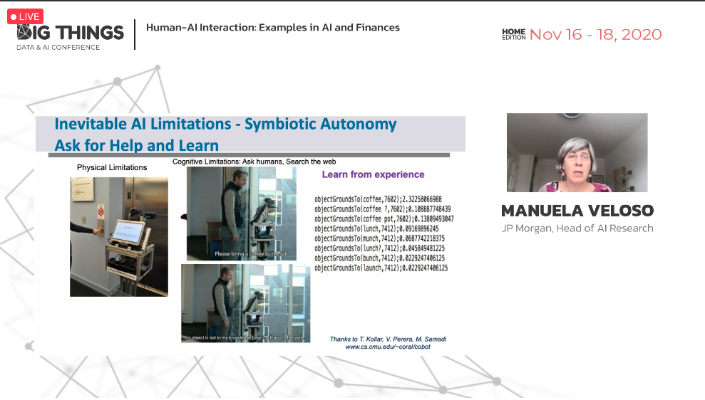
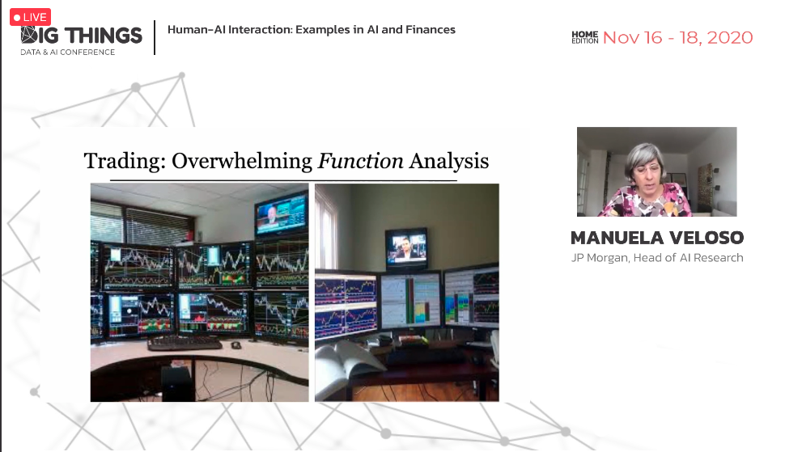
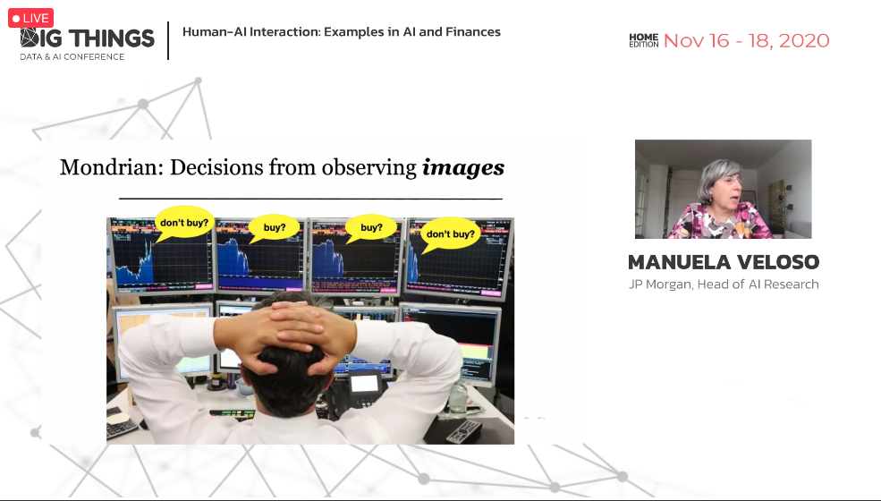
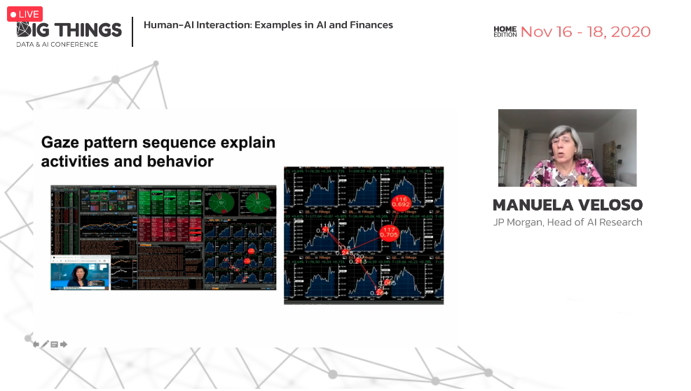

# Big Things - Data & AI Conference

## Datos generales
* **Fecha:** 16-18 de noviembre 2020
* **Organiza:** [Paradigma](https://www.paradigmadigital.com/)
* **Descripción:** Big Things will continue spreading technological, innovative and inspiration content. We have to adapt and find virtual ways to meet those needs in new ways.

[Más información](https://www.bigthingsconference.com/){: .btn  .btn-blue }

## Índice de charlas escuchadas
* Human AI interaction - [Ver notas](#1-human-ai-interaction)

## 1. Human AI interaction
*Manuela Velosos - JP Morgan*

**Autonomía simbiótica:** (*Symbiotic Autonomy*) sistemas que son autónomos pero que para ciertas tareas necesitan ayuda humana. Esta solicitud de feedback por parte de los sistemas supone un cambio de cultura. Es un enfoque de aprendizaje a través de la experiencia.

En el contexto financiero, las personas están rodeadas de pantallas con datos y visualizaciones. Los traders toman decisiones simplemente observando imágenes. **¿Y si entrenásemos a un modelo con imágenes para predecir si comprar o no comprar?** De esta forma las imágenes pueden asociarse con decisiones concretas.

Para intentar descubrir porqué se toma una decisión se pueden utilizar *gaze trakers* que **registran el recorrido de la mirada a la hora de tomar esas decisiones.** Con esta información el sistema puede aprender el patrón de la toma de decisión.

