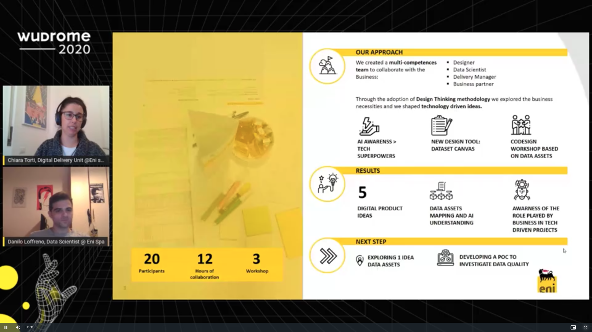
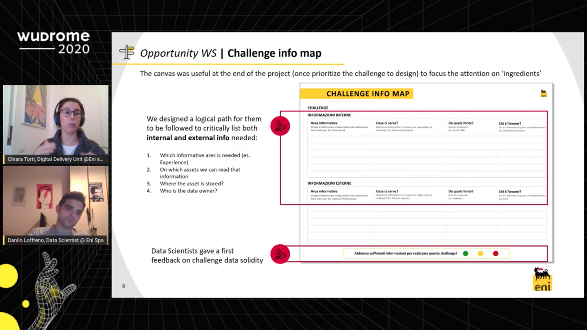

# WudRome 20202 - Human Centered AI

## Datos generales
* **Fecha:** 11 - 13 de noviembre 2020
* **Organiza:** [N01s3 - Experience Design Agency](https://ixda.org/)
* **Descripción:** The World Usability Day Rome, organized by NOIS3 – Experience Design Agency, is an event that every year brings together in Rome designers, researchers, developers and communication professionals from around the world, with the mission of spreading usability practices and human-centered design principles.

[Más información](https://www.wudrome.it/en/){: .btn  .btn-blue }

## Índice de charlas
1. Designing with AI (Google) - [Ver notas](#1-designing-with-ai)
2. School of rock of AI - [Ver notas](#2-school-of-rock-of-ai)
3. A tale of Human Centered AI - [Ver notas](#3-a-tale-of-human-centered-ai)
4. Workshop: Collective Algorithms for human interactions - [Ver notas](#4-workshop-collective-algorithms-for-human-interactions)
5. Design Responsibly: Human AI interactions (Microsoft) - [Ver notas](#5-design-responsibly-human-ai-interactions)
6. Human centered Design of Conversational Agents  - [Ver notas](#6-human-centered-design-of-conversational-agents) ⭐
7. Employee experience and AI - [Ver notas](#7-employee-experience-and-ai)
8. Combining AI and Behavior Science - [Ver notas](#8-ai-and-behavior-science)
9. Explaining AI Superpowers - [Ver notas](#9-ai-superpowers) ⭐
10. Phydigital design meets AI - [Ver notas](#10-phydigital-design-meets-ai)
11. Workshop: Hack the AI - [Ver notas](#11-workshop-hack-the-ai) ⭐
12. Data meditation - [Ver notas](#12-data-meditation)

## 1. Designing with AI
*Trond Wuellner & Nick Matarese - Google*

Nos comparten una serie de consejos y aprendizajes que han tenido desde su experiencia:

* **Consider simpler solutions.** El Machine Learning no es siempre la mejor solución para todo.
* **Fake with real people and test your idea.** Para el lanzamiento del altavoz inteligente primero probaron el concepto introduciendo en las entrevistas un segundo toma-notas "sospechoso". El objetivo de esta persona era el de controlar las respuestas del altavoz. La idea era la de aprender qué es lo que puede funcionar y lo que no, antes de invertir en desarrollo.
* **Know how to be wrong.** En este caso decidieron hacer más complicado de despertar el sistema de cara a preservar la privacidad de los usuarios y que no se despertara por error tan fácilmente.
* **Ensure that you can understand everybody.** Aquí se destaca la importancia de entrenar con datos diversos y entrenar a los asistentes con voces de personas con discapacidad.
* **Plan to learn.** En el caso de Google Photos se pedía a los usuarios que confimaran quién estaba en la foto. *Don't guess, confirm with humans."* En caso de necesitar desambiguar, hazlo con personas.
* **Do as much as you can with the less data.**
* **Think how some users will missuse the product.** Y establece los sistemas para reducir el impacto.

## 2. School of rock of AI
*Sebastienn Bratieres - [Pi School](https://picampus-school.com/programme/school-of-ai/)*

Presenta la *Pi School*, un proyecto de formación donde las empresan aportan sus datos, un reto y la aportación económica y el alumnado simplemente pone las ganas. Parece una buena oportunidad de poner en práctica los conocimientos en un proyecto con la orientación de gente con más experiencia.

## 3. A tale of Human Centered AI
*Alessandro Giulianelli - Konica Minolta Global R&D*

Se estima que para el 2022, solo el 20% de los insights darán algún tipo de resultado y solo el 15% de los casos de uso de las técnicas de IA serán exitosos. Evidencias de Gartner apuntan que solo el 53% de las pruebas de concepto transicionarán con éxito a un producto.

Hay un desalineamiento de los objetivos de negocio y las expectativas de lo que realmente la IA puede ofrecer. Partir de asunciones erróneas, trabajar con un set limitado de información y no tener claro el porqué de lo que se hace no ayuda a que el proceso sea exitoso.

Propone que se abandone un enfoque centrado en tecnología donde el porqué se reemplaza por el qué, y la idea será identificar esos proyectos que pueden aportar valor a los clientes.

 Identifica el design thinking como un serie de técnicas que pueden incrementar el ratio de éxito.Se debe empezar entendiendo por el problema de negocio, junto con sus valores y objetivos relacionados. El design thinking pondrá las personas primero y ayudará a entender el cambio que se espera en el comportamiento.

**System Usability Score.** Invest time  to explain what the AI is doing.

## 4. Workshop: Collective Algorithms for human interactions

 ¿Cómo podríamos utilizar los algoritmos para construir comunidad? Los algoritmos aprenden cómo somos de forma individual, pero cómo sería si aprendieran cómo nos somos de forma collectiva. ¿Es posible que los algoritmos de personalización estén separando a las personas?

* [Board de Miro](https://miro.com/app/board/o9J_lf--wUA=/) (Password: 2020wudworkshop)
* [Rapid protyping templates](https://docs.google.com/presentation/d/12iQ_x6tbLpYPd-fKz917nk-iZjgE1GsDUWrq7TLhVFw/edit#slide=id.ga983fe112e_0_56)

**Conclusiones workshop**
* Es interesante ver el enfoque constructivo de una inteligencia que se pone al servicio de mejorar nuestras habilidades más humanas.
* A la hora de facilitar, es interesante cómo se puede conseguir una definición de un concepto más o menos consensuado a través de la divergencia.
* A la hora de generar nuevas alternativas, es interesante el ejercicio de polinizar. Eliges un elemento de cada categoría y formas una realidad
* Lo sencillo y lo simple de los prototipos rápidos. Tienen una gran potencia para condensar ideas en lo realmente importante.

 > *I don't have the option to choose my society. I'm Iranian, I don't want to see the german top ten.*

## 5. Design Responsibly: Human AI interactions
*[Ruth Kikin-Gil](https://ruthkikin.com/) - Microsoft*

¿Qué significa la responsabilidad en el campo de la inteligencia artificial? La IA aborda problemas humanos complicados y no especialmente técnicos. ¿Qué es lo complicado de los retos de IA? La privacidad, la seguridad y la cantidad de datos que se necesitan.

Desde Microsoft junto con Aether han desarrallado una serie de guidelines para ayudar a pasar de los principios y la práctica. Este toolkit tiene forma de baraja de cartas.

* [Guidelines for Human-AI Interaction](https://www.microsoft.com/en-us/research/project/guidelines-for-human-ai-interaction/)

Comparte algunas evidencias de estos principios:
* **La IA es probabilística**, y a veces comete errores. Parece confiable y científica pero sus predicciones no son 100% seguras.
* **La IA cambia y aprende con el tiempo** pero esto no siempre es bueno. Cuenta que en caso de un aborto seguir viendo anuncios de cosas de bebés puede ser un trago duro de superar.
* **La IA revienta el principio de consistencia** el contenido personalizado y la visualización del mismo no se muestra de la misma manera.
* **El principio de prevención de error** un buen diseño puede ayudar a mitigar estas problemáticas que presenta la IA. Ej. Un bot que se corrige a sí mismo como lo hacemos las personas en un chat (minaña *migraña), es una forma de expresar que no es un bot perfecto y que va a cometer errores.

## 6. Human centered Design of Conversational Agents
*Ilaria Scarpellini - Service Designer*

Las interfaces de voz tienen potencial para amplificar la conexión con las personas, pero sonar tan humanas hace que las expectativas de los usuarios sean aún mayores, y haga más difícil entender el propósito de estas interfaces.

Los roles serían un punto de arranque para diseñar un bot. Entender el propósito que tienen puede servir para que las personas se sientan más cómodas compartiendo información con los agentes conversacionales.

* Paper: [Role-Based Design of Conversational Agents: Approach and Tools](https://link.springer.com/chapter/10.1007/978-3-030-60700-5_47)

## 7. Employee experience and AI
*Marco Tagliavache - RINA*

En una compañía si no se llega a entender a la plantilla, dificílmente se va a llegar a entender a la clientela. Conocimiento interno vs. conocimiento externo.

La inteligencia artificial está cambiando la forma que tenemos de trabajar:
* **Procesos de selección:** con el prescreening de candidatos
* **Gaming:** para evaluar a los candidatos, y evaluar las habilidades que se necesitan para el puesto
* **Procesos de onboarding:** los chatbots pueden ser una buena ayuda para ayudar a las nuevas incorporaciones a familiarizarse con su nuevo rol
* **Vigilancia en el trabajo:** se aprecia como un riesgo y una invasión de la privacidad. Existen sistemas que analizan el contenido de los emails para valorar si los empleados están satisfechos.

## 8. AI and Behavior Science
*Avantika Mohapatra - [AIxDesign.co](https://aixdesign.co/) / [peaceinnovation.com](https://www.peaceinnovation.com/)*

El Behavior Science es el estudio del comportamiento humano, y este comportamiento se suele explicar a través de la *Nudge Theory*. El comportamiento se compone de (B=MAT): M= motivación, A= ability o capacidad, T= trigger o un desencadenante.

¿Cómo podríamos hacer sentir a las personas que tienen a la tecnología bajo control y no al revés? ¿Cómo es posible que cosas que se diseñan para ser divertidas puedan convertirse en experiencias no agradables? (Ej. el índice de depresión relacionado con el uso de redes sociales) ¿Cuánto debemos confiar en estas cajas negras de las IAs?

>Deberíamos cuestionarnos dónde está la ganancia de las personas. (Where's the win for the human?)

## 9. AI Superpowers
*Chiara Torti and Fanilo Loffreno - Eni Spa*

Explican el proceso de design sprint adaptado a proyectos de data science.

## 10. Phydigital design meets AI
*Zaira Magliozzi - Superficial Studio*

La experimentación y el *making* tienen un impacto superior a nivel cognitivo. Si queremos ser memorables tenemos que poner a la gente a trabajar, invitarles a tomar la acción.

## 11. Workshop: Hack the AI
*Debora Bottá - Tangity / [uxlab.it](http://www.uxlab.it/index.html)*

El diseño no es nunca un acto neutral y cuando decimos que estamos diseñando para el bien deberíamos preguntarnos ¿pero para quién va ser ese bien? Solo la IA nunca va a ser la solución. Deberemos usar los datos para ofrecer valor a las personas, una experiencia que la IA será capaz de crear.

> Libro: Future Ethics C. Bowles ([Ver en Amazon](https://www.amazon.es/dp/1999601912))

El éxito dependerá de implementar un proceso ético a través de la colaboración (Ej. equipos de desarrollo). Desde el diseño únicamente será algo que no podamos alcanzar.

**Ethical premorten** dinámica para identificar los riesgos de un producto. Simplemente es pensar en un futuro cercano a 5 años y reflexionar qué podría torcerse éticamente en el caso de ir mal.

* Tablero de Miro: [miro.com/app/board/o9J_lfWe8tI=/](https://miro.com/app/board/o9J_lfWe8tI=/)

> Necesitamos entender cuál es el significado detrás de cada principio ético. ¿Qué es lo que implica a nivel práctico?

**Recursos sobre diseño y ética en IA:**
* [Systems Thinking Toolkit FSG](https://www.fsg.org/tools-and-resources/systems-thinking-toolkit-0)
* [Everyday Ethics for Artificial Intelligence - IBM](https://www.ibm.com/watson/assets/duo/pdf/everydayethics.pdf)
* [Every Single Cognitive Bias in One Infographic](https://www.visualcapitalist.com/every-single-cognitive-bias/)
* [Ethics Assessment - Spotify](https://docs.google.com/document/d/1sOWZhs8zZCRoERPjFBmwYqo9K55FsZG557lOAFCqjLY/edit#heading=h.fe1ku3ujtbc1)
* [The Designated Dissenter - card deck](https://www.thedesignateddissenter.com/)
* [Ethics for designers](https://www.ethicsfordesigners.com/)
* [Design Ethically](https://www.designethically.com/)
* [Design Guide - Center for Humane Technology](https://www.humanetech.com/designguide)
* [The Tarot Cards of Tech](http://tarotcardsoftech.artefactgroup.com/)
* [Data Ethics Canvas - ODI](https://theodi.org/article/data-ethics-canvas/)
* [Ethics Kit](https://ethicskit.org/)
* [AI design ethics overview - IBM](https://www.ibm.com/design/ai/ethics/)
* [Inside the AI Playbook - Frog](https://www.frogdesign.com/designmind/inside-the-ai-playbook)
* [AI & Ethics: Collaborative Activities for Designers - IDEO](https://www.ideo.com/post/ai-ethics-collaborative-activities-for-designers)

## 12. Data meditation
*Salvatore Laconessi y Oriana Persico - [HER She loves data](https://www.he-r.it/activity/research/)*

¿Cómo podemos crear rituales en esta nueva forma de vivir? HER es un centro de investigación donde el arte y la cienca colaboran para tener un impacto real en la sociedad a través de artefactos existenciales significativos.

El ecosistema está compuesto por la naturaleza, árboles... pero también está compuesto por empresas que tienen identidades y que reaccionan de forma emocional (Ej. reacciones en la bolsa). Necesitamos parar de diseñar para las personas e incluir en el sistema a las entidades no-humanas.

En esta era que vivimos necesitamos para sobrevivir una cantidad ingente de datos, el análisis y la capacidad computacional. (Ej. de supervivencia: pandemia, cambio climático...)

Durante el confinamiento la única forma de superar el encierro era (y es) mirar a los datos a diaro. ¿Cuántos contagios hay hoy? Con esta misma reflexión hicieron un experimento en un *summer-camp* recolectando datos durante el día sobre cómo se sentían los participantes. Al final del día había una reunión en la que se conversaba sobre los datos recogidos, era una nueva forma de interactuar de un modo presente.

> Data can became sounds, images... Things that can stimuli humans in different ways
